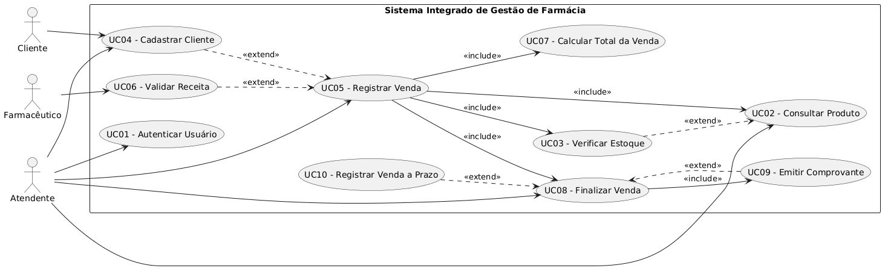
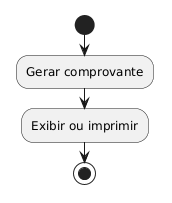
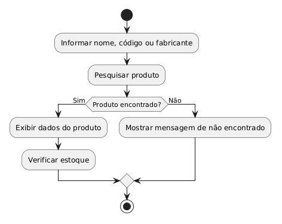
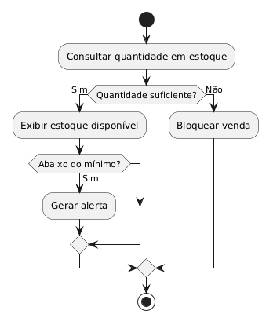
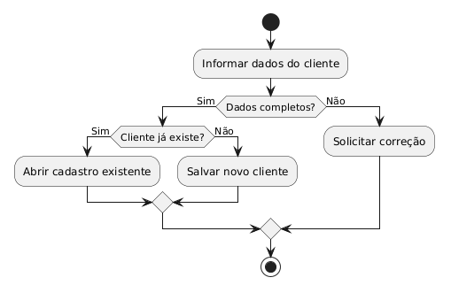
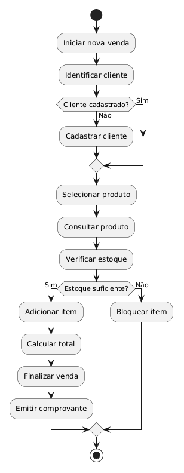
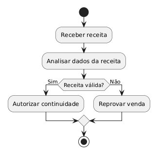
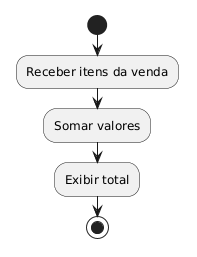
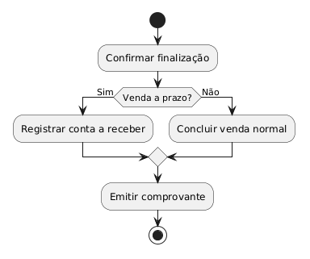
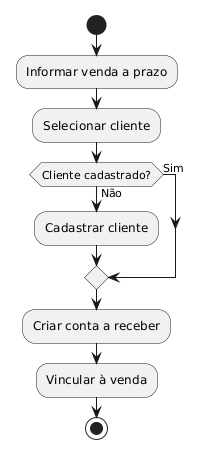

# Avaliação — Engenharia de Software
**Sistema Integrado de Gestão de Farmácia — MVP Definido pelo Estudante**

**Aluno:** Mateus Oliveira Milane  
**RA:** 24000308  
**Data:** 26/03/2026  

---

# 1. Definição do MVP
Meu MVP foca no atendimento no balcão e no processo de venda, por ser a parte mais crítica do dia a dia da farmácia. Inclui funcionalidades como cadastro de cliente, consulta de produtos, verificação de estoque, registro de venda, validação de receita, controle de pagamento (à vista e a prazo), atualização de estoque, emissão de comprovante e registro básico de contas a receber.

Ficam de fora módulos mais complexos, como compras, contas a pagar, relatórios avançados e integração entre unidades.

Escolhi esse escopo para manter o projeto viável, focando no essencial e resolvendo um problema real sem deixar o sistema grande demais.

---

# 2. Regras de Negócio (mínimo: 5)

**RN01 —** Um produto só pode ser vendido se houver estoque suficiente na unidade selecionada.  
**RN02 —** Produtos que exigem receita médica só podem ser vendidos após validação da receita.  
**RN03 —** Se o cliente não estiver cadastrado, ele deve ser cadastrado antes de finalizar a venda.  
**RN04 —** Toda venda realizada deve atualizar automaticamente a quantidade em estoque.  
**RN05 —** Venda a prazo deve gerar um lançamento em contas a receber com status inicial “Aberta”.  
**RN06 —** O sistema deve permitir pesquisa de produtos por nome, código de barras ou fabricante.  
**RN07 —** Quando o estoque do produto estiver abaixo do mínimo definido, o sistema deve alertar o usuário.
**RN08 —** O comprovante da venda deve ser emitido ao final do processo.

---

# 3. Requisitos Funcionais (mínimo: 8)

**RF01 —** O sistema deve permitir autenticar usuários antes de acessar as funções internas. 
**RF02 —** O sistema deve permitir consultar produtos por nome, código de barras ou fabricante.  
**RF03 —** O sistema deve permitir verificar a disponibilidade de estoque por unidade.  
**RF04 —** O sistema deve permitir cadastrar clientes de forma rápida durante o atendimento.  
**RF05 —** O sistema deve permitir registrar vendas de produtos.  
**RF06 —** O sistema deve validar receita médica quando o produto exigir esse controle.  
**RF07 —** O sistema deve atualizar automaticamente o estoque após a finalização da venda.  
**RF08 —** O sistema deve gerar comprovante da venda.
**RF09 —** O sistema deve registrar vendas a prazo em contas a receber.
**RF10 —** O sistema deve alertar quando um produto estiver com estoque abaixo do mínimo.

---

# 🛡 4. Requisitos Não Funcionais (mínimo: 4)
Liste os RNFs do sistema conforme seu MVP.

**RNF01 —** O sistema deve responder às consultas de produtos em até poucos segundos, para não atrasar o atendimento no balcão.  
**RNF02 —** O sistema deve possuir controle de acesso por usuário, evitando que pessoas sem permissão executem funções indevidas.  
**RNF03 —** O sistema deve manter os dados de vendas e estoque salvos de forma segura, evitando perda de informação.  
**RNF04 —** O sistema deve ser intuitivo e fácil de usar, pois será utilizado em ambiente com atendimento rápido.  
**RNF05 —** O sistema deve funcionar de forma estável mesmo com várias operações sendo feitas ao mesmo tempo.

---

# 5. Casos de Uso (mínimo: 10)

---

# 6. Documentação dos Casos de Uso

## **UC01 — Autenticar Usuário**
**Ator(es):** Atendente, Farmacêutico 
**Descrição:** Permite que o usuário acesse o sistema com login e senha. 
**Pré-condições:** O usuário deve possuir cadastro no sistema. 
**Pós-condições:** O usuário fica autenticado e apto a usar as funções permitidas. 

### Fluxo Principal
1. O usuário informa login e senha. 
2. O sistema valida os dados. 
3. O sistema libera o acesso. 
4. O usuário entra na tela principal. 

### Fluxos Alternativos / Exceções
- FA01 — Dados inválidos: o sistema exibe mensagem de erro e bloqueia o acesso. 
- FA02 — Usuário inativo: o sistema impede o login. 

### Relacionamentos
- **Include:** nenhum  
- **Extend:** nenhum  

---

## **UC02 — Consultar Produto**
**Ator(es):** Atendente
**Descrição:** Permite buscar um produto pelo nome, código de barras ou fabricante. 
**Pré-condições:** O usuário deve estar autenticado. 
**Pós-condições:** O produto consultado é exibido com suas informações básicas. 

### Fluxo Principal
1. O atendente acessa a consulta de produto. 
2. Informa um critério de busca.
3. O sistema pesquisa os produtos. 
4. O sistema mostra os resultados encontrados.

### Fluxos Alternativos / Exceções
- FA01 — Produto não encontrado: o sistema informa que não há resultado. 
- FA02 — Critério incompleto: o sistema solicita nova tentativa. 

### Relacionamentos
- **Include:** UC03 — Verificar Estoque  
- **Extend:** nenhum  

---

## **UC03 — Verificar Estoque**
**Ator(es):** Atendente
**Descrição:** Verifica se existe quantidade suficiente do produto na unidade. 
**Pré-condições:** O produto precisa estar cadastrado.
**Pós-condições:** O sistema informa a quantidade disponível.

### Fluxo Principal
1. O sistema recebe o produto selecionado.
2. Consulta a quantidade em estoque.
3. Exibe a quantidade disponível.
4. Se houver pouco estoque, emite alerta.

### Fluxos Alternativos / Exceções
- FA01 — Estoque zerado: o sistema bloqueia a venda. 
- FA02 — Estoque abaixo do mínimo: o sistema emite alerta ao usuário. 

### Relacionamentos
- **Include:** nenhum
- **Extend:** nenhum  

---

## **UC04 — Cadastrar Cliente**
**Ator(es):** Atendente
**Descrição:** Permite cadastrar rapidamente um novo cliente durante o atendimento.
**Pré-condições:** O usuário deve estar autenticado.
**Pós-condições:** O cliente fica disponível para futuras vendas.

### Fluxo Principal
1. O atendente seleciona a opção de cadastro.
2. Informa os dados básicos do cliente.
3. O sistema valida as informações.
4. O sistema grava o cadastro.

### Fluxos Alternativos / Exceções
- FA01 — Cliente já cadastrado: o sistema avisa e reaproveita o cadastro existente.
- FA02 — Dados incompletos: o sistema solicita correção.

### Relacionamentos
- **Include:** nenhum
- **Extend:** UC05 — Registrar Venda

---

## **UC05 — Registrar Venda**
**Ator(es):** Atendente
**Descrição:** Registra os itens comprados pelo cliente e inicia o processo da venda.
**Pré-condições:** Usuário autenticado e produto consultado.
**Pós-condições:** A venda fica registrada no sistema.

### Fluxo Principal
1. O atendente inicia uma nova venda.
2. Informa o cliente.
3. Consulta e adiciona os produtos.
4. O sistema verifica estoque.
5. O sistema calcula os valores.
6. A venda segue para finalização.

### Fluxos Alternativos / Exceções
- FA01 — Cliente não cadastrado: o sistema permite acionar o cadastro.
- FA02 — Estoque insuficiente: o sistema bloqueia o item.
- FA03 — Produto controlado: o sistema exige validação de receita.

### Relacionamentos
- **Include:** UC02 — Consultar Produto; UC03 — Verificar Estoque; UC07 — Calcular Total da Venda; UC08 — Finalizar Venda
- **Extend:** UC04 — Cadastrar Cliente; UC06 — Validar Receita; UC10 — Registrar Venda a Prazo

---

## **UC06 — Validar Receita**
**Ator(es):** Farmacêutico
**Descrição:** Confere se a receita apresentada está válida para a venda de um medicamento controlado.
**Pré-condições:** A venda precisa envolver um produto que exija receita.
**Pós-condições:** A receita é aprovada ou recusada.

### Fluxo Principal
1. O farmacêutico recebe a receita.
2. Analisa os dados do documento.
3. O sistema registra a validação.
4. A venda é liberada, se estiver tudo certo.

### Fluxos Alternativos / Exceções
- FA01 — Receita inválida: a venda é bloqueada.
- FA02 — Receita vencida: o sistema informa a irregularidade.

### Relacionamentos
- **Include:** nenhum
- **Extend:** UC05 — Registrar Venda

---

## **UC07 — Calcular Total da Venda**
**Ator(es):** Sistema
**Descrição:** Soma os valores dos itens da venda e mostra o total para o atendente.
**Pré-condições:** Existem itens adicionados na venda.
**Pós-condições:** O total é calculado e exibido.

### Fluxo Principal
1. O sistema recebe os itens da venda.
2. Soma quantidades e valores.
3. Aplica o total final.
4. Exibe o resultado.
   
### Fluxos Alternativos / Exceções
- FA01 — Item com valor desatualizado: o sistema recalcula com base no preço atual.

### Relacionamentos
- **Include:** nenhum
- **Extend:** nenhum

---

## **UC08 — Finalizar Venda**
**Ator(es):** Atendente
**Descrição:** Conclui a operação de venda e registra o fechamento da transação.
**Pré-condições:** A venda já deve estar montada com os itens.
**Pós-condições:** A venda é concluída e o sistema libera a emissão do comprovante.

### Fluxo Principal
1. O atendente confirma a venda.
2. O sistema valida os dados finais.
3. O sistema conclui a operação.
4. O comprovante pode ser emitido.

### Fluxos Alternativos / Exceções
- FA01 — Falha na finalização: o sistema mantém a venda em aberto.
- FA02 — Venda a prazo: o sistema registra a conta a receber.

### Relacionamentos
- **Include:** UC09 — Emitir Comprovante
- **Extend:** UC10 — Registrar Venda a Prazo

---

## **UC09 — Emitir Comprovante**
**Ator(es):** Sistema
**Descrição:** Gera o comprovante da venda com os dados da operação.
**Pré-condições:** A venda deve estar finalizada.
**Pós-condições:** O comprovante é emitido para o cliente.

### Fluxo Principal
1. O sistema recebe os dados da venda.
2. Monta o comprovante.
3. Exibe ou imprime o documento.
4. Finaliza o processo.

### Fluxos Alternativos / Exceções
- FA01 — Falha de impressão: o sistema permite reimprimir depois.

### Relacionamentos
- **Include:** nenhum
- **Extend:** UC08 — Finalizar Venda

---

## **UC10 — Registrar Venda a Prazo**
**Ator(es):** Atendente, Sistema
**Descrição:** Registra uma venda com pagamento futuro e cria a movimentação em contas a receber.
**Pré-condições:** A venda deve ser aprovada para pagamento posterior.
**Pós-condições:** A conta a receber fica registrada com status “Aberta”.

### Fluxo Principal
1. O atendente informa que a venda será a prazo.
2. O sistema identifica o cliente.
3. O sistema cria o lançamento financeiro.
4. A venda é vinculada à conta a receber.

### Fluxos Alternativos / Exceções
- FA01 — Cliente sem cadastro: o sistema solicita cadastro antes de seguir.
- FA02 — Dados financeiros incompletos: o sistema bloqueia o lançamento.

### Relacionamentos
- **Include:** nenhum
- **Extend:** UC08 — Finalizar Venda

---

> Repita essa estrutura para **todos os seus casos de uso** (mínimo 10).

